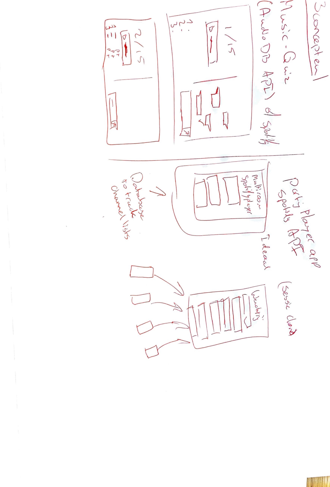

# Beej

A webapp that clubs can use to let their customers request music without being overloaded. Beej let's you create slots where your customers can bid to play their favourite song. To create some interaction between the club and the customer, live-bidding is enabled and customers can request any song they like without having to talk to the DJ, which is hard during a party.

- [Beej](#beej)
  - [Live demo](#live-demo)
  - [To install](#to-install)
  - [Features](#features)
    - [Club registration/login](#club-registrationlogin)
    - [Club dashboard for administration and management](#club-dashboard-for-administration-and-management)
    - [Simple customer interface](#simple-customer-interface)
    - [Live bidding and updates](#live-bidding-and-updates)
  - [Data structure](#data-structure)
    - [Slot](#slot)
    - [User](#user)
  - [Sockets](#sockets)
  - [Feature list](#feature-list)
    - [Must have](#must-have)
    - [Should have](#should-have)
    - [Could have](#could-have)
    - [Would have](#would-have)
  - [Data flow](#data-flow)
  - [Other concepts](#other-concepts)
  - [License](#license)

## Live demo

You can find a live demo [here](https://beej-rtw.herokuapp.com/)

## To install

Clone this repository using `git clone` and run `npm install` in this directory. Then run `npm run dev` to start the development server and start hacking away.

## Features

### Club registration/login

  
  
  Simple sigup form with minimal information for clubs. When signing up only this info is necessary to make the app work.

### Club dashboard for administration and management

  
  
  An admin dashboard where clubs can manage their room and slots.

### Simple customer interface

  

### Live bidding and updates

  

A simple form for customers to submit their songrequest. When sent, every client get's updated via the socket to supply them with live info.

## Data structure

For this app, MongoDB is the database of choice. Using Mongoose (v6.3.1), I created 2 simple models to regulate data streams.

### Slot

The slots are small models where I keep track of the highest bid, songrequest and with which club the slot is associated. Slots are continously updated when new bids are received and old bids are not saved.

_Slot model_

### User

The user model is only needed for the clubs that register on this app. Without club, there are no auctions. So when the club is registered

_User model_

## Sockets

The websockets are used to update clients that are in a certain room. Whenever a bidding event happens, other clients are updated with new data to keep everyone at the same level.

## Feature list

### Must have

- [x] Club registration
- [x] Create request slots
- [x] Submit a request
- [x] Live updated slot overview

### Should have

- [ ] Status indicators for slots (updated, closed, new bid, etc.; More socket events to add)
- [ ] Connect with spotify api for song requests
- [ ] Customer protection (limit bid amounts and increments)

### Could have

- [ ] QR-code scanner to join room
- [ ] Blind auction mode so bidding is more exciting and less about money

### Would have

- [ ] Extra UI-states for feedback
- [ ] More complex but easier to manage datastructure

## Data flow

## Other concepts

Some other conepts I had when in the ideation phase. I made some quick sketches to visualize what my ideas where;

## License

Licensed by MIT, autored by Kai van Wezel
